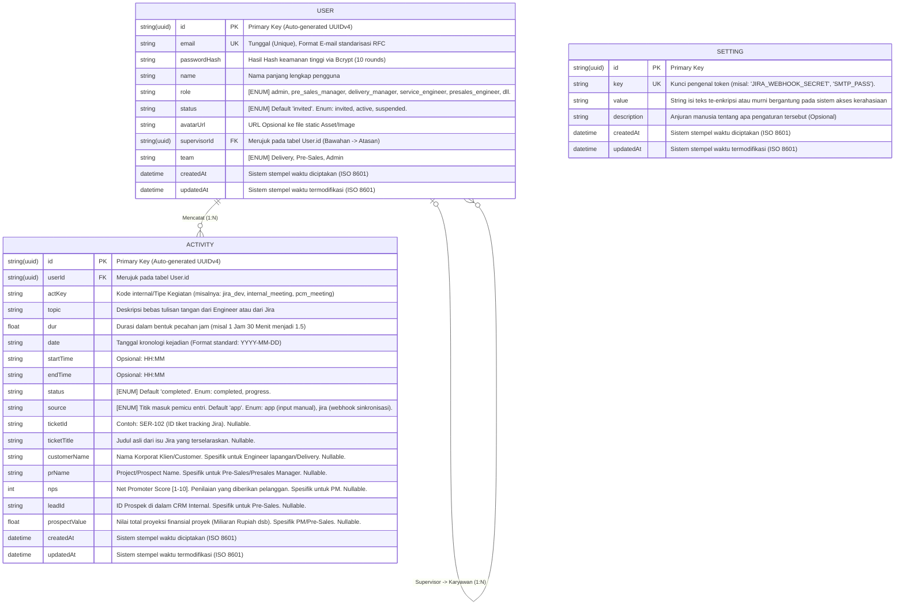

# 📊 Entity Relationship Diagram (ERD) & Database Schema

Dokumen ini mendeskripsikan secara komprehensif struktur basis data (Tabel, Tipe Data, Constraints, dan Relasi) yang digunakan oleh *backend* `daily-report` untuk melayani seluruh *flow* aplikasi, dari pelaporan manual hingga sinkronisasi otomatis menggunakan Webhook.

## 1. Visualisasi ERD

Diagram ERD di bawah ini mengilustrasikan tiga tabel entitas utama beserta keterkaitan antar satu sama lain. Relasi terpusat pada *User* (karyawan). Setiap karyawan bisa memiliki bawahan karyawan lain (relasi rekursif), dan membawahi banyak *Activity* log harian.

---

## 2. Kamus Data & Indexing (Data Dictionary)

Berikut adalah pendalaman sifat tipe data (`DDL` - _Data Definition Language_) yang diterapkan pada mesin pangkalan data target (PostgreSQL rilis 15+).

### Tabel: [User](file:///Users/wisnu/Data/Dev/engineer-logs/daily-report-backend/src/controllers/userController.ts#7-28) (Karyawan & Staff Administrator)
Basis utama identitas dan otorisasi. 

| Nama Kolom | PostgreSQL Type | Nullable | Default | Spesifikasi Ekstra & *Constraints* |
| :--- | :--- | :---: | :---: | :--- |
| [id](file:///Users/wisnu/Data/Dev/engineer-logs/daily-report-dashboard/src/components/Sidebar.jsx#5-51) | `UUID` | No | `uuid_generate_v4()` | Menghindari celah *enumeration/ID guessing attack* untuk API. Kunci primer (`PK`). |
| `email` | `VARCHAR(255)` | No | - | Memiliki relasi *Uniqueness Constraint* (B-tree indeks `UNIQUE`). Mengeliminir duplikasi ganda karyawan. |
| `passwordHash` | `VARCHAR(60)` | No | - | Digunakan spesifik untuk otentikasi (JWT + Bcrypt). Panjang konstan 60 byte karakter. |
| `name` | `VARCHAR(100)` | No | - | Tidak memerlukan aturan unik. |
| `role` | `VARCHAR(30)` | No | - | Biasanya dijaga dengan cek level program (misal: `"admin", "service_engineer", "project_manager"`). Membantu pembatasan otorisasi RBAC (Role-Based Access Control). |
| `status` | `VARCHAR(10)` | No | `'invited'` | *State machine* pengguna. Seorang akun tercipta dengan status `invited`, lalu pengguna mendaftarkan PIN pertama berubah ke `active`, atau diberhentikan secara admin via `suspended`. |
| `avatarUrl` | `TEXT` | Yes | `NULL` | Dapat memuat basis panjang karakter tak ketara (bucket path dari S3 / Blob Storage URI). |
| `supervisorId`| `UUID` | Yes | `NULL` | Membuat rantai hierarkis komando (`FK`) pada diri tabel [User](file:///Users/wisnu/Data/Dev/engineer-logs/daily-report-backend/src/controllers/userController.ts#7-28) itu sendiri. Atasan mutlak tertinggi seperti eksekutif tidak punya atasan, shg membolehkan setelan `NULL`. |
| `team` | `VARCHAR(30)` | Yes | `NULL` | Klasterisasi filter perolehan (Pre-Sales / Delivery / Support Services). |
| `createdAt` | `TIMESTAMP` | No | `NOW()` | Indeks w aktu pengolahan statis untuk rekam jejak. |
| `updatedAt` | `TIMESTAMP` | No | `NOW()` | Menggunakan fungsi _trigger_ di belakang layar jika ditangani langsung via psql atau fitur penangan ubah dari Prisma. |

### Tabel: `Activity` (Daftar Jam Kerja Ekstensif)
Tulang punggung catatan harian dan agregator skor KPI.

| Nama Kolom | PostgreSQL Type | Nullable | Default | Spesifikasi Ekstra & *Constraints* |
| :--- | :--- | :---: | :---: | :--- |
| [id](file:///Users/wisnu/Data/Dev/engineer-logs/daily-report-dashboard/src/components/Sidebar.jsx#5-51) | `UUID` | No | `uuid_generate_v4()` | Kunci primer entitas pelaporan harian tunggal (`PK`). |
| `userId` | `UUID` | No | - | Kunci Relasional `FK` terhadap [User(id)](file:///Users/wisnu/Data/Dev/engineer-logs/daily-report-backend/src/controllers/userController.ts#7-28). Cenderung dikonfigurasi kaskade/Hapus Otomatis ( `ON DELETE CASCADE`) untuk memastikan tak ada rantai terputus/yatim piatu (orphan blocks) manakala *User* itu dihapus telak. |
| `actKey` | `VARCHAR(50)` | No | - | Kodifikasi aktivitas *hard-coded* per konsensus (`ACTS` konstanta). Tentukan apakah ini logistik harian standar atau laporan teknis. |
| `dur` | `DOUBLE PRECISION`| No | - | Penyimpanan float 64-bit/32-bit (Real). Durasi waktu dalam fraksi desimal. 15 Menit = `0.25`, Setengah Jam = `0.5`, 45 Menit = `0.75`. |
| [date](file:///Users/wisnu/Data/Dev/engineer-logs/daily-report-backend/src/controllers/userController.ts#59-76) | `CHAR(10)` | No | - | Sengaja dibentuk bertipe Date String `YYYY-MM-DD` sebagai ganti `TIMESTAMP` agar jauh lebih seragam dan bebas komplikasi *Time Zone Offset* untuk grafik. Indikator pemotongan kuarter `Q1-Q4`. |
| `status` | `VARCHAR(15)` | No | `'completed'` | Penentu kelulusan task. `progress` menandai task multi-hari. Hanya yang `completed` yang secara umum dihitung KPI. |
| `source` | `VARCHAR(4)` | No | `'app'` | Pemisah statistik mana pencatatan karya organik aplikasi (Manual Input/`app`), dan mana yang otomasi tarikan (`jira`). |
| `topic`, `ticketId`, `ticketTitle`, `customerName`, `prName`, `leadId`, `startTime`, `endTime` | `VARCHAR/TEXT` | Yes | `NULL` | Serangkaian properti opsional elastis yang nilainya terisi selektif dikotomi sub-divisinya sendiri. |
| `prospectValue`| `REAL` | Yes | `NULL` | Float numerik berstandarisasi pelaporan pra-purna jual (bisa digunakan untuk *Leaderboard by Project Value*). |
| `nps` | `SMALLINT` | Yes | `NULL` | Indikator *Net Promoter Score* antara -100 ke 100 dengan skala 0 ke 10. Dipakai khusus PM untuk indeks kesempurnaan implementasi. |

### Tabel: `Setting` (Konfigurasi Modular Global)
Penyimpanan kunci-nilai *dynamic* global tanpa perlunya mengubah berkas [.env](file:///Users/wisnu/Data/Dev/engineer-logs/daily-report-backend/.env).

| Nama Kolom | PostgreSQL Type | Nullable | Default | Spesifikasi Ekstra & *Constraints* |
| :--- | :--- | :---: | :---: | :--- |
| [id](file:///Users/wisnu/Data/Dev/engineer-logs/daily-report-dashboard/src/components/Sidebar.jsx#5-51) | `UUID` | No | `uuid_generate_v4()` | PK. |
| `key` | `VARCHAR(50)` | No | - | UK (Unique identifier index) spt. `smtp.username`, `jira.domain`, `jira.api_token`. |
| `value` | `TEXT` | No | - |  |

---

## 3. Asumsi Implementasi Sistem Terkait ERD

- Indeks tambahan akan dibangun pada tabel `Activity` khusus kolom komposit: [(userId, date)](file:///Users/wisnu/Data/Dev/engineer-logs/daily-report-dashboard/src/components/MembersView.jsx#22-23) agar mesin pemanggil riwayat sebulan pengguna (atau _chart aggregation_) bisa di-*query* dengan sangat pesat _O(log N)_.
- Kelemahan kueri analitik KPI dalam model normalisasi RDBMS ini (*OLTP*) dapat dikapitalisasi dengan mengalkulasikan perolehan skoring di *Back-End* Node.js untuk di-_cache_, ketimbang memaksa komputasi _Live Query_ matematis di peranti lunak PG yang berpotensi *bottleneck*. 
