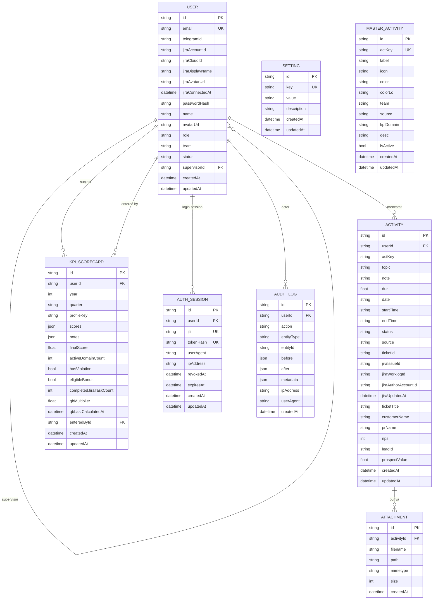

# Database ERD

Dokumen ini mencerminkan schema database yang saat ini dipakai oleh `daily-report-backend`.
Implementasi sekarang menggunakan Prisma dengan MongoDB.

## 1. ERD Ringkas

## 2. Entitas Utama

### User
Penyimpanan identitas pengguna aplikasi.

Field penting:
- `email`, `passwordHash`, `name`, `role`, `team`, `status`
- `supervisorId` untuk hierarki atasan-bawahan
- `jiraAccountId`, `jiraCloudId`, `jiraDisplayName`, `jiraAvatarUrl`, `jiraConnectedAt`
- `telegramId` untuk integrasi bot Telegram

Relasi:
- satu `User` bisa punya banyak `Activity`
- satu `User` bisa punya banyak `KpiScorecard`
- satu `User` bisa punya banyak `AuthSession`
- satu `User` bisa menjadi actor di `AuditLog`

### Activity
Catatan aktivitas harian.

Field penting:
- `actKey`, `topic`, `note`, `dur`, `date`, `startTime`, `endTime`, `status`
- `source` membedakan input manual (`app` / `telegram`) dan sinkron otomatis (`jira`)
- `ticketId`, `jiraIssueId`, `jiraWorklogId`, `jiraAuthorAccountId`, `jiraUpdatedAt`
- `customerName`, `prName`, `nps`, `leadId`, `prospectValue`

Relasi:
- satu `Activity` bisa punya banyak `Attachment`

### Attachment
Lampiran untuk sebuah activity.

### Setting
Kunci-nilai konfigurasi aplikasi.

Digunakan untuk:
- token invite
- token Telegram link
- setting lain yang sifatnya dinamis

### MasterActivity
Definisi master kategori aktivitas.

Dipakai untuk:
- label UI
- ikon dan warna
- team scope
- source (`app` / `jira`)
- pemetaan domain KPI

### KpiScorecard
Penyimpanan nilai KPI manual per user per periode.

Field penting:
- `year`, `quarter`, `profileKey`
- `scores`, `notes`
- `finalScore`, `activeDomainCount`, `hasViolation`, `eligibleBonus`
- `completedJiraTaskCount`, `qbMultiplier`, `qbLastCalculatedAt`
- `enteredById`

### AuthSession
Session refresh token yang diputar untuk auth.

Dipakai untuk:
- login cookie berbasis refresh token
- rotasi session
- logout

### AuditLog
Jejak perubahan aktivitas user dan sistem.

Dipakai untuk:
- audit create/update/delete
- audit login/logout
- audit KPI save/recalculate
- audit integrasi Jira/Telegram

## 3. Index dan Constraint Penting

- `User.email` unik
- `MasterActivity.actKey` unik
- `Setting.key` unik
- `KpiScorecard` punya unique compound index:
  - `userId + year + quarter`
- `AuthSession.jti` unik
- `AuthSession.tokenHash` unik

## 4. Catatan Implementasi

- Database saat ini berbasis MongoDB, bukan SQL relasional murni.
- Activity yang berasal dari Jira disimpan sebagai `source = jira`.
- Activity manual dari aplikasi tetap bisa dibuat melalui web dan bot.
- KPI saat ini memakai scorecard manual untuk domain, lalu app menghitung rata-rata dan aturan bonus.
- Audit trail dan refresh token sudah menjadi bagian dari flow runtime.

