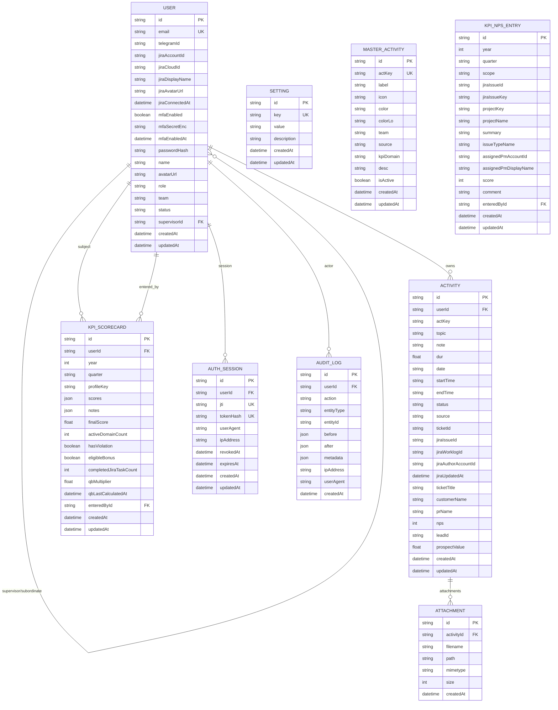

# Database ERD

Dokumen ini mencerminkan schema database yang dipakai oleh `daily-report-backend`.
Implementasi menggunakan Prisma dengan datasource MongoDB.

Sumber kebenaran teknis: `daily-report-backend/prisma/schema.prisma`.

## 1. ERD Ringkas

Catatan Mermaid: Prisma belum mendefinisikan relasi eksplisit dari `KpiNpsEntry.enteredById` ke `User`, tetapi field tersebut menyimpan id user penginput NPS secara aplikatif.

## 2. Entitas

### User

Menyimpan identitas user, auth profile, integrasi, MFA, dan hierarki organisasi.

Field penting:

- `email` unik.
- `passwordHash`.
- `name`, `avatarUrl`, `role`, `team`, `status`.
- `supervisorId` untuk hubungan atasan-bawahan.
- `telegramId` untuk link Telegram bot.
- `jiraAccountId`, `jiraCloudId`, `jiraDisplayName`, `jiraAvatarUrl`, `jiraConnectedAt` untuk integrasi Jira.
- `mfaEnabled`, `mfaSecretEnc`, `mfaEnabledAt` untuk TOTP/MFA.

Relasi:

- `User.activities`
- `User.kpiScorecards` sebagai subject KPI.
- `User.kpiEntered` sebagai penginput KPI.
- `User.authSessions`
- `User.auditLogs`
- self-relation supervisor/subordinates.

### Activity

Menyimpan aktivitas harian manual, Telegram, dan hasil sinkronisasi Jira.

Field umum:

- `actKey`, `topic`, `note`, `dur`.
- `date`, `startTime`, `endTime`.
- `status`: `completed`, `progress`.
- `source`: `app`, `telegram`, `jira` secara logika aplikasi.

Field Jira:

- `ticketId`, `jiraIssueId`, `jiraWorklogId`.
- `jiraAuthorAccountId`, `jiraUpdatedAt`.
- `ticketTitle`.

Field Presales/PM:

- `customerName`, `prName`, `nps`.
- `leadId`, `prospectValue`.

Relasi:

- wajib punya `userId`.
- bisa punya banyak `Attachment`.

Catatan:

- Activity dari Jira tidak boleh diedit manual.
- Activity manual dapat diedit selama bukan hasil sync Jira.
- Prospect pipeline dihitung unik berdasarkan `leadId` dengan nilai terbaru.

### Attachment

Menyimpan metadata file lampiran activity.

Field:

- `filename`, `path`, `mimetype`, `size`.
- `activityId` dengan cascade delete.

Catatan aplikasi:

- Upload dibatasi ke tipe dokumen yang diizinkan.
- Frontend menyediakan preview/download attachment.

### Setting

Key-value store untuk konfigurasi dinamis.

Contoh penggunaan:

- token invite/activation.
- token link Telegram sementara.
- SMTP setting terenkripsi/tersimpan.
- penanda reminder Telegram agar tidak terkirim duplikat.
- konfigurasi integrasi lain yang tidak cocok menjadi kolom dedicated.

### MasterActivity

Master taxonomy aktivitas.

Field:

- `actKey` unik sebagai key referensi activity.
- `label`, `icon`, `color`, `colorLo`.
- `team`: `delivery`, `presales`, `all`.
- `source`: `app`, `jira`.
- `kpiDomain`: mapping ke domain KPI seperti `impl`, `pm`, `cm`, `enh`, `ops`.
- `isActive` untuk menonaktifkan pilihan tanpa menghapus riwayat.

### KpiScorecard

Menyimpan scorecard KPI per user per quarter.

Field:

- `userId`, `year`, `quarter`.
- `profileKey`.
- `scores` JSON per domain.
- `notes` JSON untuk catatan, manual inputs, dan snapshot automation.
- `finalScore`, `activeDomainCount`, `hasViolation`.
- `eligibleBonus`, `completedJiraTaskCount`, `qbMultiplier`, `qbLastCalculatedAt`.
- `enteredById`.

Constraint:

- unique compound `userId + year + quarter`.

Catatan aplikasi:

- Scorecard saat ini bersifat hybrid: sebagian dihitung otomatis dari Jira, sebagian manual.
- Domain delivery: Implementation, Preventive Maintenance, Corrective Maintenance, Enhancement, Operational Service/MSS.
- QB memakai `completedJiraTaskCount` dan `qbMultiplier`.

### KpiNpsEntry

Menyimpan NPS per item Jira, bukan lagi nilai general.

Field:

- `year`, `quarter`.
- `scope`: `impl_project` atau `op_task`.
- `jiraIssueId`, `jiraIssueKey`.
- `projectKey`, `projectName`.
- `summary`, `issueTypeName`.
- `assignedPmAccountId`, `assignedPmDisplayName`.
- `score` skala 1-4.
- `comment`.
- `enteredById`.

Constraint:

- unique compound `year + quarter + scope + jiraIssueKey`.

Aturan aplikasi:

- `[IMP]`: NPS diinput per epic/project yang Done pada periode tersebut.
- `[OP]`: NPS diinput per task yang Done pada periode tersebut.
- PM hanya melihat item yang terhubung dengan BAST assigned PM.
- Manager/head delivery dapat melihat semua item yang relevan.
- Jika belum diinput, score dianggap `N/A` untuk perhitungan.

### AuthSession

Menyimpan refresh token session.

Field:

- `userId`.
- `jti` unik.
- `tokenHash` unik.
- `userAgent`, `ipAddress`.
- `revokedAt`, `expiresAt`.

Catatan:

- Token mentah tidak disimpan.
- Logout/revoke menandai `revokedAt`.

### AuditLog

Menyimpan event audit.

Field:

- `userId` nullable.
- `action`, `entityType`, `entityId`.
- `before`, `after`, `metadata`.
- `ipAddress`, `userAgent`, `createdAt`.

Contoh event:

- login/logout.
- create/update/delete activity.
- upload/delete attachment.
- update member.
- save KPI/NPS.
- connect/disconnect Jira.
- update SMTP/master activity.

## 3. Constraint Dan Index Penting

- `User.email` unik.
- `MasterActivity.actKey` unik.
- `Setting.key` unik.
- `AuthSession.jti` unik.
- `AuthSession.tokenHash` unik.
- `KpiScorecard`: unique `userId + year + quarter`.
- `KpiNpsEntry`: unique `year + quarter + scope + jiraIssueKey`.

## 4. Alur Data Penting

### Activity Manual

1. User memilih `MasterActivity`.
2. Aplikasi menyimpan `Activity` dengan `source = app` atau flow Telegram.
3. Optional attachment disimpan ke `Attachment`.
4. Audit log dibuat untuk perubahan penting.

### Activity Jira

1. Jira webhook/worklog diterima backend.
2. User dipetakan lewat `jiraAccountId`.
3. Worklog disimpan sebagai `Activity` dengan `source = jira`.
4. Update worklog mengubah activity yang sama berdasarkan `jiraWorklogId`.

### KPI Scorecard

1. Admin/manager memilih user dan quarter.
2. Backend mengambil data Jira sesuai profile user.
3. Backend menghitung domain otomatis dan membaca `KpiNpsEntry`.
4. Hasil disimpan/upsert ke `KpiScorecard`.
5. Report membaca scorecard dan activity periode terkait.

### KPI NPS

1. Backend menemukan item eligible dari Jira:
   - `[IMP]` epic/project Done pada quarter.
   - `[OP]` task Done pada quarter.
2. PM/head menginput score 1-4.
3. Data disimpan ke `KpiNpsEntry`.
4. Perhitungan KPI memakai rata-rata NPS per item.

### Report

1. Activity Report membaca `Activity`, `Attachment`, `User`, dan `MasterActivity`.
2. KPI Report membaca `KpiScorecard`, activity quarter, dan breakdown Jira di `notes/scores`.
3. Executive Report mengambil data SUP dari Jira secara runtime dan memakai mapping customer di aplikasi.

## 5. Catatan MongoDB/Prisma

- Semua `id` memakai MongoDB ObjectId via `@db.ObjectId`.
- ERD ini menggambarkan relasi aplikasi; MongoDB tidak menerapkan foreign key seperti SQL.
- Relasi Prisma tetap dipakai untuk query dan cascade pada model tertentu.
- Beberapa data integrasi disimpan sebagai JSON (`scores`, `notes`, audit payload) agar fleksibel terhadap perubahan aturan KPI.
